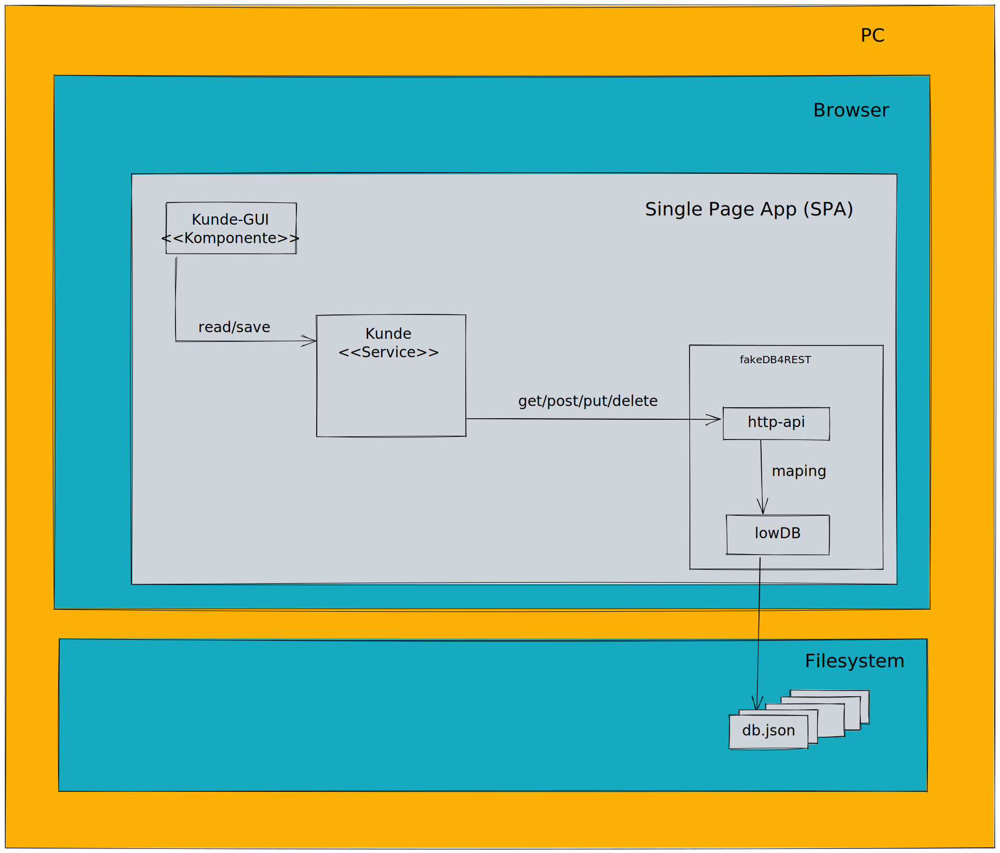

# fakeDB4REST
REST API gesteuerte Datenbank zum Persistieren von SPA Zuständen im Client Filesystem zur Verwendung als Backend Mock.

Als echte Datenbank zum Speichern der Zustände wird zunächst mit lowDB gestartet. 

